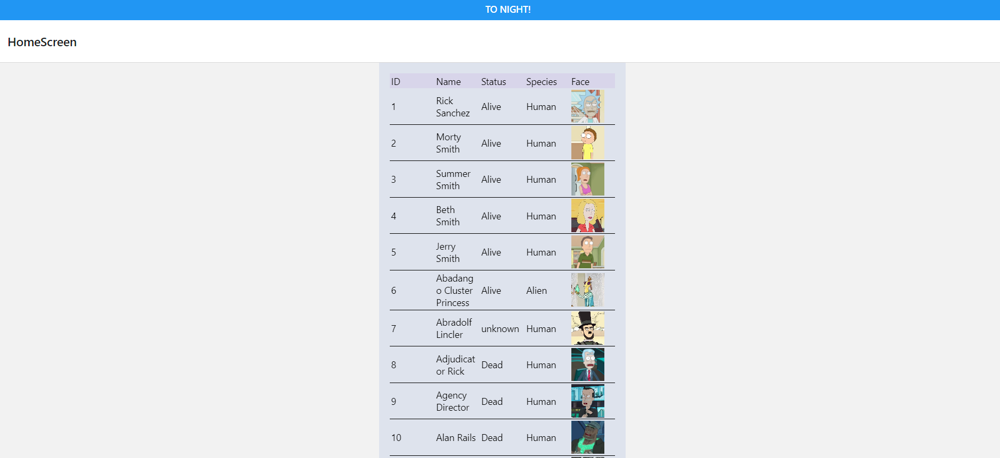
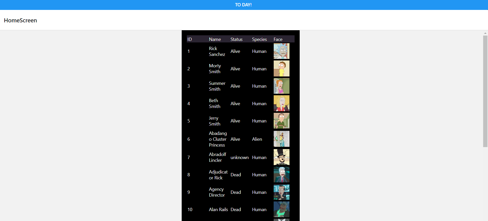
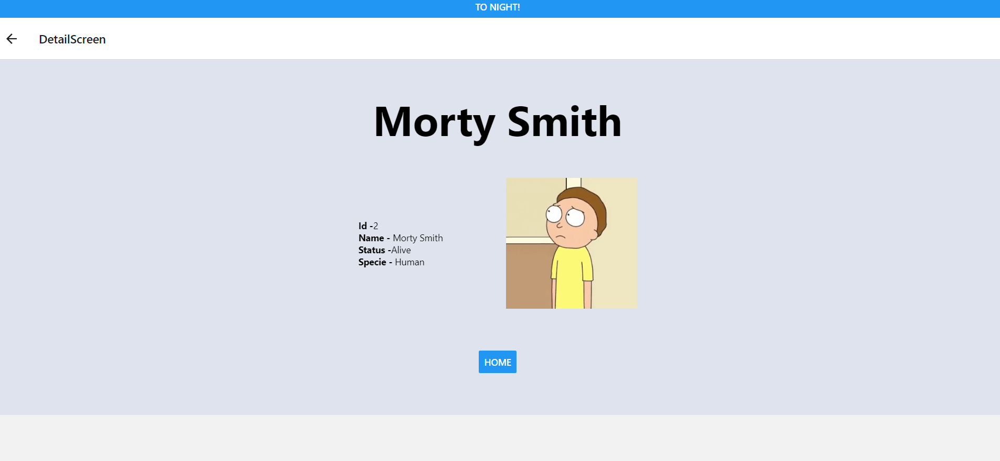
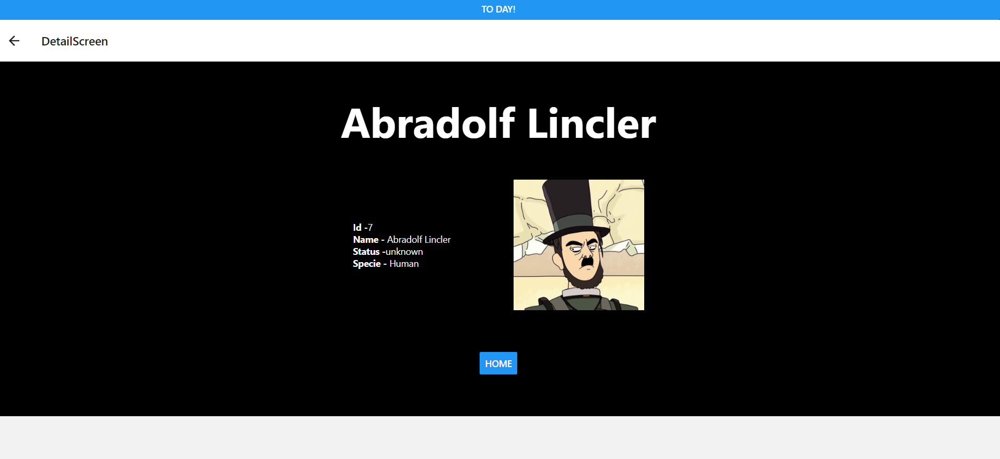

# REACT-Native

## General information

This project consists of creating, with React-Native using expo,  a website with the following functions:
1- Create a grid/card with rows showing data.
2- When the screen starts, make a request to an API, in this case Ricky Morty's API, and render the data in the Grid.
3- Add dark/light mode
4- When you click on an element, it must redirect you to a view with its specific data.

## See the project

To see the project on your computer, you should do the following steps:

1- Clone the repository : git clone https://github.com/JavierMoyaSimo/test-3.git
2- cd test-3/
3- cd miThirdProject/
4- Install dependencies: npm i
5- View project locally: npx expo start
6- Press the "w" key to view your project on the web: w

## Views

Main view: 'Home' (Light mode)
 

 

Main view: 'Home' (Dark mode)
 

 

## To go to the Detail view, click on the image

Detail view: (Light mode)
 

 

Detail view: (Dark mode)

 

 

## Technologies, dependencies and libraries

- [HTML5](https://html5.org/)
- [JavaScript](https://www.javascript.com/)
- [React-native](https://reactnative.dev/)
- [Redux](https://redux.js.org//)

---

## Author

Javier Moya Simó

- [Linked In](https://www.linkedin.com/in/javier-moya-simo/)
- [Github](https://github.com/JavierMoyaSimo)

---

## License

---
